# Reddit Flair Detection

Hi, Nice to meet you! This is the Github repository for the Web Application Fetch the Flair. This project is based on flair detection of a Subreddit India post. A flair is the category of a Reddit post used for filtering purposes. The project uses PRAW (Python Reddit API Wrapper) and Big Data Query to obtain the dataset for training.  Transfer learning is used to train the classification model for this project. The Deep Learning model  used is XLNet. For model training and validation Ktrain, an advanced python wrapper for Keras (Tensorflow 2.0), was used. This Project has been developed as a task for MIDAS-IIITD. The development phase is divided into 5 phases, namely :

 1. Reddit Web Scraping
 2. Exploratory Data Analysis and Pre-processing
 3. Reddit Flair Prediction Model training and validation
 4. Development of Web App based on Flask Rest API
 5. Deployment of Web App on GCP (Google Cloud Platform)
 
 The website Fetch the Flair is live at:
[https://reddit-flair-predictor.uc.r.appspot.com/](https://reddit-flair-predictor.uc.r.appspot.com/#home)
(If the website is not working then probably I might have disabled the app on GCP) 
## Repository Structure & Files
The structure of the repository is represented below :
```bash
|   app.yaml
|   Dockerfile
|   forms.py
|   main.py
|   model.py
|   Predictor.preproc
|   requirements.txt
|   
+---Notebooks
|       Documentation.ipynb
|       EDA(Part-2).ipynb
|       Reddit_Flair_Detector(Part-3).ipynb
|       Reddit_Web_Scraping(Part-1).ipynb
|       
+---static
|   +---Analysis
|   |       Analysis_Data.csv
|   |       Metafeatures_Analysis.csv
|   |       
|   +---data
|   |       data.csv
|   |       data_2019_06.csv
|   |       data_2019_07.csv
|   |       data_2019_08.csv
|   |       Final_Dataset.csv
|   |       Test_Data - Copy.csv
|   |       Test_Data.csv
|   |       Train_Data.csv
|   |       Val_Data.csv
|   |       
|   +---Images
|   |   +---Github
|   |   \---Website
|
|   \---Models
|       +---model_distilbert
|       |       config.json
|       |       tf_model.h5
|       |       
|       \---model_XLNet
|               config.json
|               tf_model.h5
|               
\---templates
        Flair_detected.html
        Home.html
```
## Dockerfile & Requirements.txt

The github repo is provided with a dockerfile and requirements.txt file to recreate the app deployed in the project. The dockerfile creates a virtual environment with required python version and packages for web app deployment. The required Python version is 3.6.X. All the dependencies required for the code in the repo can be installed using requirements.txt.
```
pip install -q -r requirements.txt
```

## Notebooks

The project was developed in three parts in three respective jupyter notebooks. The whole process of project development starting from data acquisition to Web deployment has been documented in Documentation jupyter notebook. The Documentation also includes the errors faced during project development and the approach taken to solve them. The notebooks are as follows:
1. Reddit Web Scraping - Part-1
2. EDA (Exploratory Data Analysis) - Part-2
3. Reddit Flair Detector - Part-3
4. Documentation
## Data Analysis

In EDA notebook a detailed analysis of training and validation data was done. Frequency of words in different flair categories were plotted and analyzed in EDA notebook. 
At the time of project development, the flairs on Subreddit India were:
"Scheduled", "Politics", "Photography", "Policy/Economy", "AskIndia", "Sports", "Non-Political", "Science/Technology", "Food", "Business/Finance", "Coronavirus", "CAA-NRC-NPR"

The Analysis Plots are as follows:

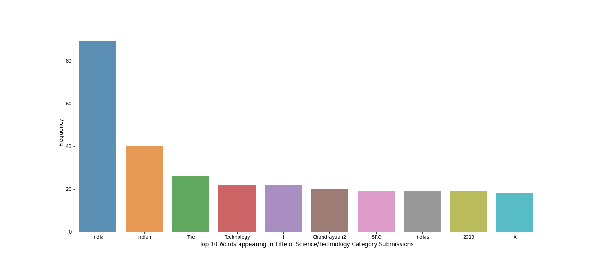
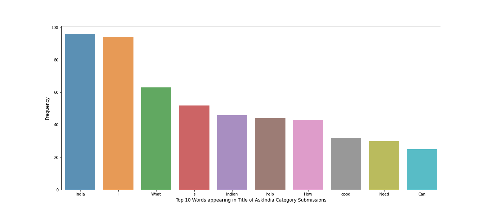
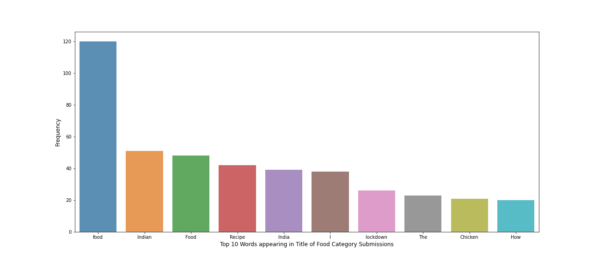
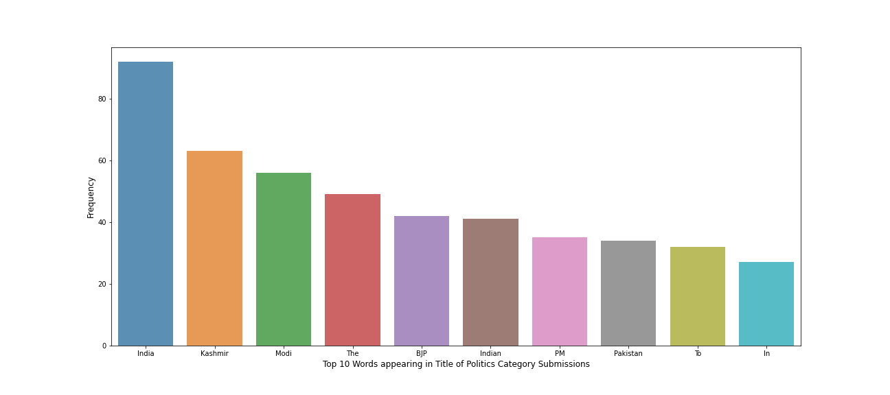
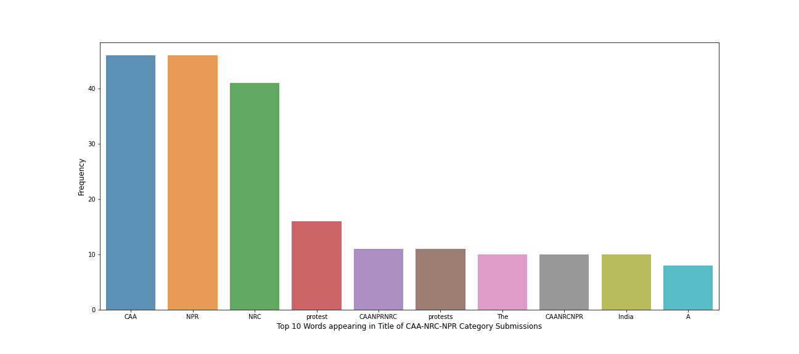
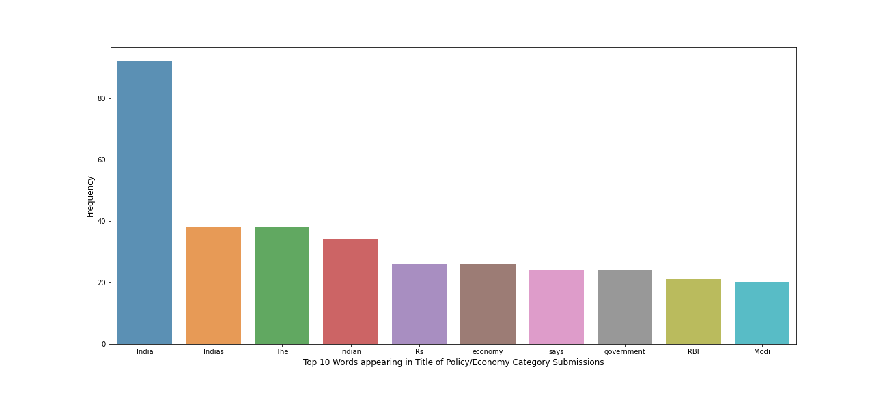

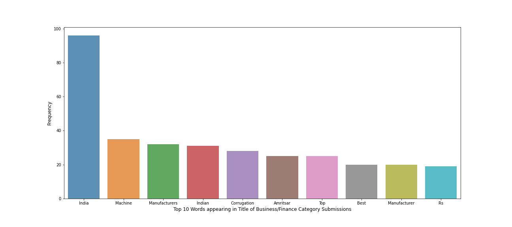
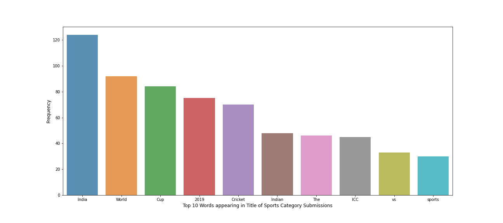
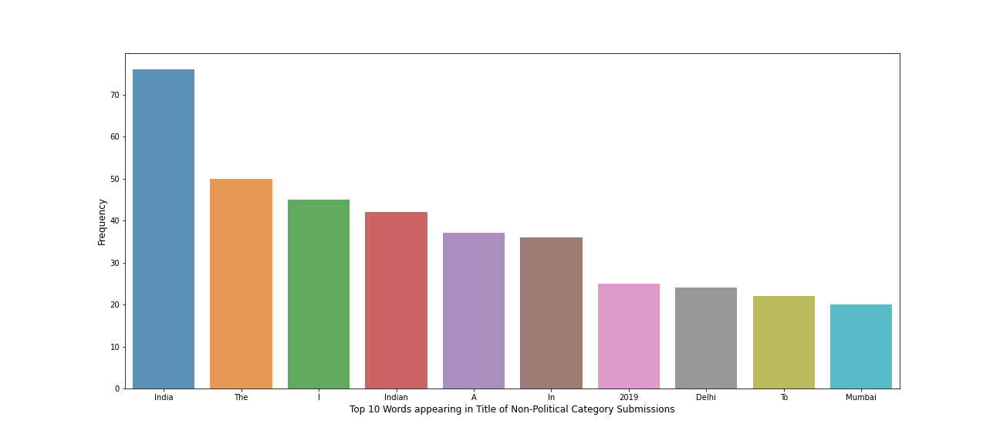
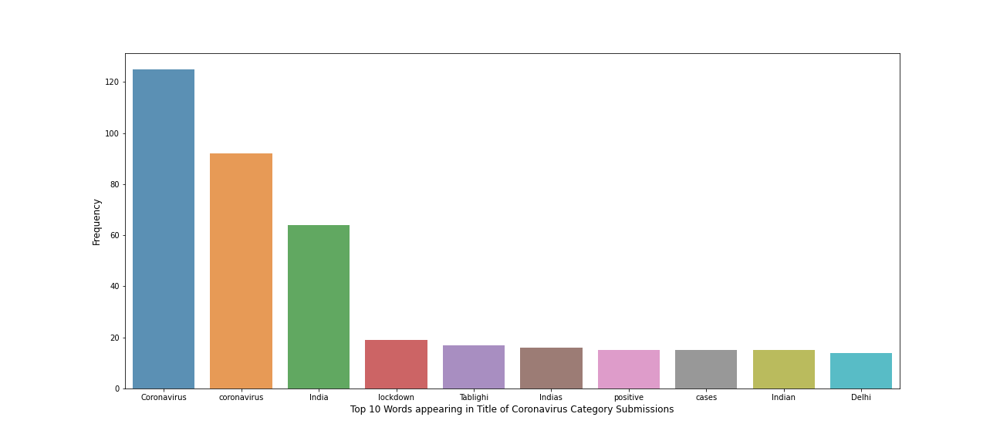
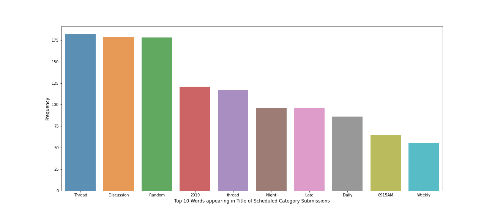
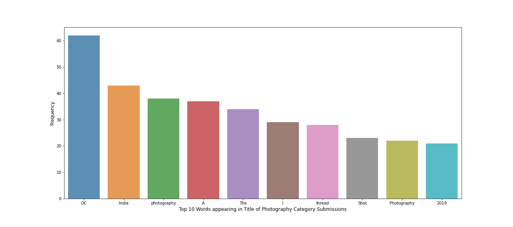

Furthermore, a stastical analysis on metafeatures was done in EDA notebook.

## XLNet Model Training and Validation

Notebook Part-3 namely Reddit-Flair-Detector contains the code for model training and detailed analysis of the validation and test results. The model XLNet showed very good performance on the task of Reddit Flair Detection. Reddit Flair Detection comes under the domain of Text Classification. The approach to the task was to use Transfer Learning on Language Models.

## Automated Testing Endpoint
The Web app has been designed to have an API endpoint called '/automated_testing' to test the model performance through a POST request. The Web API has been designed using Flask. The following code can be used to send a POST request to the website:
```
import json

import requests

url = 'https://reddit-flair-predictor.uc.r.appspot.com/automated_testing'

files = {'upload_file':  open('file.txt','rb')}

r = requests.post(url, files=files)

data = r.json()

print(data)
```
Here file.txt is a file which contains a link of a r/india post in every line.
## Web Deployment
The web app has been deployed on Google Cloud Platform at the following link:
[https://reddit-flair-predictor.uc.r.appspot.com/](https://reddit-flair-predictor.uc.r.appspot.com/#home)
The code was deployed through GCP using App Engine with the following code:
```
gcloud init
gcloud app deploy app.yaml --project project_name
```
### Thanks for checking out the repo!
